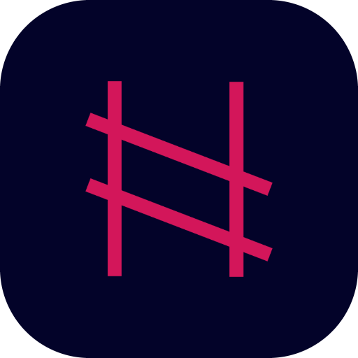

    

<h1 align="center">
    My First Android App
</h1>
<h3 align="center">
    InitConf2022 Workshop
</h3>

| Dark Theme      | Light Theme |
| ----------- | ----------- |
|  ||

This is meant to be a 4-hour long workshop.

### Workshop agenda:

0) Introduction
    - Getting to know each other
    - Introduction to the project
    - Introduction to Android Studio
    - Pulling project from GitHub
    - Creating an emulator
    - Connecting a phone to Android Studio
    - Building the project
    - Running the project
1) Building the initial app
    - Creating a new Android Project ([1a](https://github.com/VladimirWrites/InitConf2022/commit/a877d8c0434be52e5b4f273c3c101a2edd9828ee))
    - Updating dependencies ([1b](https://github.com/VladimirWrites/InitConf2022/commit/66313cd65917123575f2345cff605eb30730464b))
    - Going through different parts of an Android project
    - Introduction to Kotlin
    - Introduction to Compose
2) Expanding the UI
    - Adding model classes ([2a](https://github.com/VladimirWrites/InitConf2022/commit/dd0ddfab992d4a172da1a816c016fd9427a6518e))
    - Adding stub talk ([2b](https://github.com/VladimirWrites/InitConf2022/commit/a64596cdde0c69a69eb876136cd46f12a9523b5b))
    - Showing talk title ([2c](https://github.com/VladimirWrites/InitConf2022/commit/bec200519492dffb95b263758b9d319ab8d56a90))
    - Adding 2 more text fields for additional speaker info ([2d](https://github.com/VladimirWrites/InitConf2022/commit/2e3562bff5a64b12b62b5aa0c3a1eadf8cf16e0f))
    - Organizing fields inside Column ([2e](https://github.com/VladimirWrites/InitConf2022/commit/90d64e6eedc8e1d4e345d1bb70c2d8551d38d06a))
    - Adding Coil library ([2f](https://github.com/VladimirWrites/InitConf2022/commit/4077ff748f5d7b2b279031648482b20b578f2f45))
    - Adding image URL ([2g](https://github.com/VladimirWrites/InitConf2022/commit/bbf052d28fc16f3ea877c890414814155509a94a))
    - Showing speaker image ([2h](https://github.com/VladimirWrites/InitConf2022/commit/b685fda5ecd7e3be68707bbba38b5c2bac19c5f2))
    - Explaining why the image is now showing
    - Adding internet permission ([2i](https://github.com/VladimirWrites/InitConf2022/commit/65a10ef119fb1d52cc7efc39be075210b4adab90))
    - Making the image round ([2j](https://github.com/VladimirWrites/InitConf2022/commit/85897c93453b8e50cdbc19f4e036fb8db9e9b468))
    - Adding padding and alignment ([2k](https://github.com/VladimirWrites/InitConf2022/commit/8e3e19846c0d0575724b8c1730541344a7d31d9a))
    - Adding text styling ([2l](https://github.com/VladimirWrites/InitConf2022/commit/278a01f45a7337fbed305a8159c3e0c9e162795a))
3) Creating a list of talks
    - Adding stub list of talks ([3a](https://github.com/VladimirWrites/InitConf2022/commit/20de51777fdd16a5c4fdf28e736c110e6937ffb5))
    - Adding LazyColumn ([3b](https://github.com/VladimirWrites/InitConf2022/commit/e2ad1987d4f4d5691c319aad23daf7e72e31afd8))
    - Using LazyColumn to show talks in the list ([3c](https://github.com/VladimirWrites/InitConf2022/commit/21c3745be8efeea58042d1fbaed935d803b6b70e))
    - Showing Toast when an item is clicked ([3d](https://github.com/VladimirWrites/InitConf2022/commit/80daad5be528bf4099ae056d3b53c04a788c96a7))
4) Next steps
    - Going through the next steps to learning Android
    - Material and resources for learning Android development
    - Explaining the next steps that can be done to improve the project
